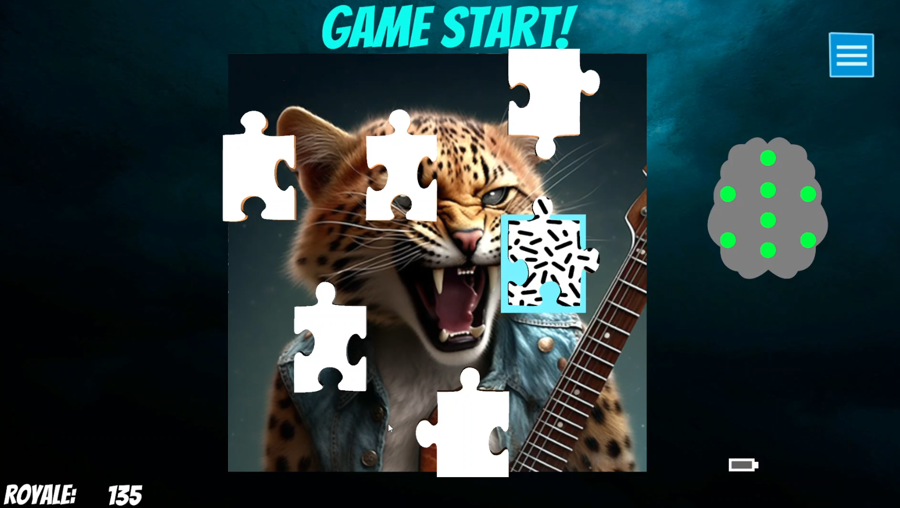

[Brainbuddy](#brainbuddy) 
&nbsp;&nbsp;&nbsp;[Open 'Brainbuddy' from Unicorn Suite Hybrid Black](#open-brainbuddy-from-unicorn-suite-hybrid-black) 
&nbsp;&nbsp;&nbsp;[Brainbuddy Gameplay](#brainbuddy-gameplay) 
[Platformer](#platformer) 
&nbsp;&nbsp;&nbsp;[Open 'Platformer' from Unicorn Suite Hybrid Black](#open-platformer-from-unicorn-suite-hybrid-black) 
&nbsp;&nbsp;&nbsp;[Platformer Gameplay](#platformer-gameplay) 
[Puzzle Game](#puzzle-game) 
&nbsp;&nbsp;&nbsp;[Open 'Puzzle Game' from Unicorn Suite Hybrid Black](#open-puzzle-game-from-unicorn-suite-hybrid-black) 
&nbsp;&nbsp;&nbsp;[Puzzle Game Gameplay](#puzzle-game-gameplay) 
# Brainbuddy

Developed during a BCI game jam 2022 for impaired children, this platformer game utilizes a brain-computer interface (BCI) for control. Players can engage in multiplayer mode, with one player controlling the character via keyboard input and the other using the BCI. Alternatively, the game can be played solo by simultaneously controlling the character with both the keyboard and BCI. The objective is to collect fruits scattered throughout the game world. Success relies on effectively coordinating control between the BCI and keyboard, making it necessary to master both input methods to complete the game. This inclusive and challenging gaming experience encourages cognitive and motor skill development while fostering cooperation in multiplayer gameplay.

## Open 'Brainbuddy' from Unicorn Suite Hybrid Black

Open the Unicorn Suite Hybrid Black. Open the 'Apps' tab and select 'Brainbuddy'. Select the device serial and click 'Open'.

 

## Brainbuddy Gameplay
Select your device and click  'connect'.

 

Upon accessing the screen, you will find detailed instructions on how to maneuver the characters. You are presented with two options. You can either play solo utilizing the Brain-Computer Interface (BCI), where you focus on flashing objects to initiate actions. Simultaneously, you can use the keyboard for character movement, employing the W/A/S/D or Left/Right/UP/Down keys. Pressing the Up key (W) propels the character into a jump, while the left (A) and right (D) keys dictate directional movement. You can also play with a friend. So one person is using the BCI and the other one uses the keyboard.

 

Wait until the electrodes in the signal quality check turned green. In order to be able to control the BCI you have to perform a training. Click 'Start Flashing' to start the training. Focus on the flashing object. 

 

If the Calibration was ok you can click on “Continue”. You can also click on “Retrain” if you want to do the Calibration again. 

 

Focus on the flashing objects in order to select them and create new platforms or let obstacles disapear. Try not to fall by jumping from one platform to another. Also collect as much fruits as possible.

 

 

 

If you reached the end of the game and collected the trophy you completed the adventure of “Brainbuddy”. You will also see the score you reached.

 

# Platformer

In this unique platformer game, players must simultaneously control both the keyboard and a brain-computer interface (BCI) to successfully navigate and complete the game. The BCI employs a code based visually- evoked potential (CVEP) paradigm, where specific visual cues trigger brain responses that are translated into in- game actions. By strategically coordinating their attention and mental focus on the visual cues while also managing keyboard controls, players can guide their characters through challenging levels and overcome obstacles. This innovative gameplay experience provides a dual-channel control system that combines traditional input methods with the exciting possibilities of BCI technology, offering players a novel and engaging way to interact with the game world.

## Open 'Platformer' from Unicorn Suite Hybrid Black

Open the Unicorn Suite Hybrid Black, select “Apps” and then “Platformer”. Next you need to select your device and click on “open”.

## Platformer Gameplay
Select your device and click  'connect'.

 

Wait until the electrodes in the signal quality check in the upper right corner turned green. In order to be able to control the BCI you have to perform a training. Click 'Start Flashing' to start the training. Concentrate on the flashing object. 

 

 

After the training session is finished. The dot in the upper right corner will change colors indicating the quality of the training run. A good training would turn the color of the dot to green, an acceptable training would turn it to yellow and a bad training run would turn it to red. Click 'continue' to start the game with or 'retrain' if you want to repeat the training in order to improve the training performance.

The goal of the game is to collect all coins and reach the finish area. You can move the avatar with the arrow keys of the keyboard. You can only collect all coins if you are able to focus on the flickering items and destroying them with the BCI. Only if you are able to control the keyboard and the BCI you are able to accomplish the game.

 

 

Be careful not to get too close to the edge of this small world, or you might fall off. Stay at a safe distance to finish the game successfully. If you do fall, don't worry—the game will start again automatically.

 

The finishh area is the brightly colored area at the end of the map.

 

# Puzzle Game

Players can control the game simply by using their thoughts. With the ability to select adn flip puzzle pieces mentally in just seconds, completing the image becomes a thrilling and engaging challenge. Test it out to tune your concentration performance.

## Open 'Puzzle Game' from Unicorn Suite Hybrid Black

Open the Unicorn Suite Hybride Black, select "Apps" and then "Puzzle Game". Next, you need to select your device and click on "Open".

## Puzzle Game Gameplay

Select your device and click 'connect'.

 

You will see the following launching window.

 

In the device dropdown menu, you can view all paired unicorn devices with your PC. Please pick the serial number associated with your unicorn. If you don't have a unicorn device next to you, please select the serial number `UN-0000.00.00`, which represents a unicorn simulator.

The season number is shown on the upperleft corner. Each season, we will update the picture sets used in the Puzzle game. 

There are multiple phases for the puzzle game.
- **Connection phase**: Establishing the bluetooth connection between the unicorn hybrid black and the PC.
- **Charging phase**: Loading up your mental power (ie. train a classifier) to select puzzle pieces with BCI.
- **Game phase**

## Charging Session
After connecting to the device, the following screen will be shown to players.This session intended to train a classifier used for selecting puzzles with BCI. The whole charging session takes around 1 minute.

 

Some important points to note:
- The **topoplot** on the right indicates the signal quality of each EEG channel with positional information.

    - Green: Good EEG channel
    - Red: Bad EEG channel

- **Progress Bar** below `START!` button shows the state of charging, which increases overtime.
    

    
    
    
     
    

- `START!` button: When all EEG channels have good signal quality, press this button to **start the Charging session**.
- **MENTAL STATE** indicate how powerful you will be able to select the puzzle pieces later in the game. The number of stars will be updated after the charging session. The more stars you have, the better your BCI performance will be. See the following screenshot as reference.

    - 3 Stars: A perfect classifier. In 3-5 seconds, you will be able to pick a puzzle piece.
    - 2 Stars: An ok classifier. In 6-9 seconds, you can select a puzzle piece.
    - 1 Star: A bad classifier. You need to take more to 10 seconds to select a puzzle piece

 

**Note**: 
- If your **MENTAL STATE** is: 

    - 1 star, please re-do the Charging session for a better performance.
    - 2 stars: It is recommended to re-do the Charging session. But, you could also proceed to the **Dashboard**.
    - 3 stars: Proceed to **Dashboard**

- Click `RECHARGE!` to re-do the Charging session.
- Click `DASHBOARD` to proceed to the **Dashboard**.

## DashBoard
**Dashboard** is the main page of the Puzzle game. You can:

- Check your overal scores in game, **ROYALE**
- Check your **achievement (stars)** next to each image
- Unlock new images
- Select your image used in the puzzle game
- Exit the game

 

Select 1 image and click `PLAY`

 

## Game
You should see your **selected image** with some **puzzle pieces** on top. Now, you can focus on any puzzle piece. With a perfect **MENTAL STATE**, you should be able to select the piece in 3-5 seconds.

 

Note:
- When you selected a puzzle piece, there will be a **light-blue background** below the piece. 
- You have to stay focus for **3 seconds** in order to eliminate the piece.
- The topoplot is used for signal quality check.

### Finish 1 image
When all puzzle pieces on top of the image have been eliminated, you can:
- Click `CONTINUE` to play with the next image. 
    - If you didn't unlock all images, the system will detect the **locked images**, select one of them **randomly** and start the next game.
    - If you have unlocked all images, the system will **randomly** pick 1 image, and start the next game.
    

     
    

- There is a `panel` button on the upperright corner. You can click the button . The following **panel** will pop up.
    

     
    

    You can:
    - Click `BACK TO HOME` return to **Dashboard** and pick another image.
    - Exit the game.

### Achievements
You can check your performance for individual image in the **Dashboard**.

 

